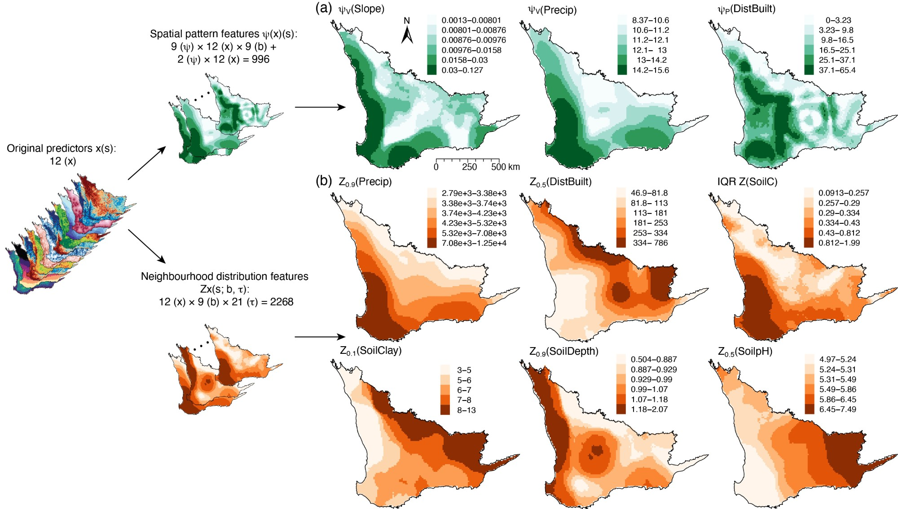

# Generalized Covariate Field (GCF): R Code, Data, and Examples

This repository provides the R implementation, example data, and usage examples of the generalized covariate field (GCF) model, published in the *International Journal of Geographical Information Science* (Song, 2026).

## Resources

- Method article (wiki): https://yongzesong.com/gcf/
- Online calculator (runs entirely in the browser): https://yongzesong.com/app/gcf/
- Reproduction tutorial (one-command R pipeline that regenerates the paper's tables): https://yongzesong.com/reproduce/gcf.html
- Full text of the paper: https://doi.org/10.1080/13658816.2026.2729719

## Citation

Song, Y. (2026). Generalized covariate field (GCF): spatial-pattern and neighbourhood-distribution feature expansion improves geospatial prediction. *International Journal of Geographical Information Science*, 40, 1–29. https://doi.org/10.1080/13658816.2026.2729719

```bibtex
@article{song2026gcf,
  title   = {Generalized covariate field ({GCF}): spatial-pattern and neighbourhood-distribution feature expansion improves geospatial prediction},
  author  = {Song, Yongze},
  journal = {International Journal of Geographical Information Science},
  year    = {2026},
  volume  = {40},
  pages   = {1--29},
  doi     = {10.1080/13658816.2026.2729719}
}
```

## Paper

**Title**

Generalized covariate field (GCF): spatial-pattern and neighbourhood-distribution feature expansion improves geospatial prediction

**Authors**

Yongze Song (School of Design and the Built Environment, Curtin University, Perth, Australia)

**Abstract**

Spatial prediction forms the basis for decision-making in Earth and environmental sciences, yet prediction accuracy is constrained by spatial heterogeneity and sparse and uneven sampling. Existing methods commonly respond by increasing algorithmic complexity while underusing the spatial information embedded in the covariates themselves. This study develops the generalized covariate field (GCF) to expand the covariate space rather than model complexity through deriving two families of features. First, spatial pattern features characterize local spatial structure, including spatial dependence, heterogeneity, geocomplexity, multiscale variation, and local outlyingness, and are transferable across space. In addition, neighbourhood distribution features summarize covariates through multiscale operators with geoscientific meaning. Finally, high-dimensional features are selected using response-independent functional reductions and spatial-block stability selection. GCF is implemented in a vascular plant species-richness study across the Southwest Australian Floristic Region, and expands 12 covariates into 3,276 candidate predictors. Results show that GCF improves prediction accuracy under both random and spatial-block validation with 8.2–21.1% higher spatial-block cross-validated R² than existing spatial learning models. The findings support the primacy of data hypothesis that enriching the spatial representation of data, rather than only increasing model structural complexity, can substantially improve prediction and provide a basis for data-centric geospatial modelling.

**Keywords**

Geospatial prediction; generalized covariate field; feature expansion; spatial cross-validation; primacy of data

## Method and code

The generalized covariate field (GCF) model is a prediction-oriented method for spatial variables: it expands raw spatial covariates into spatial-pattern and neighbourhood-distribution features and selects a stable subset of them for geospatial prediction. For each covariate `x` observed at projected coordinates, the method first computes spatial-pattern features `psi` (11 spatial operators — LISA, local Geary's c, log local variance, rank-quantile entropy, geocomplexity, log scale-variance, local variogram exponent, and signed z-score and MAD outlier strengths — over a series of buffer radii), then neighbourhood-distribution features `Z_x` (buffer-wise quantiles of the covariate values surrounding each location), reduces the collinear buffer and quantile sweeps to a compact set of interpretable functionals over two scale bands, and finally selects variables by random forest importance combined with spatial-block stability resampling and group voting. No response variable is used at any point of the feature generation; the selected variables feed any downstream regression learner.

The pipeline: `x -> psi (pattern) -> Z_x (context) -> functional reduction -> selection`, implemented in `gcf.R` as:

1. `gcf_psi()` — Step 1: spatial-pattern features (11 operators over buffer radii);
2. `gcf_zx()` — Step 2: neighbourhood-distribution features (buffer-wise quantiles);
3. `gcf_reduce()` — Step 3a: functional reduction of the sweeps to the candidate field (X raw, P pattern, D context variables);
4. `gcf_select()` — Step 3b: stable variable selection (random forest importance + spatial-block stability + group voting), with the block helper `gcf_blocks()`;
5. `gcf_field()` — runs Steps 1–3a in one call.

## GCF features in the case study

In the case study of the paper, vascular plant species richness across the Southwest Australian Floristic Region, GCF expands the 12 original spatial predictors `x(s)` into 3,276 candidate predictors. The figure below (Figure 5 in the paper) shows the expansion on the left and maps the nine derived features retained by the full-sample variable selection on the right.



**(a) Spatial pattern features `ψ(x)(s)`** quantify the local spatial structure of each predictor, such as spatial dependence, heterogeneity, geocomplexity, multiscale variation and local outlyingness. Nine operators are computed over nine buffer radii `b` and two operators are computed once per predictor, which gives 9 (ψ) × 12 (x) × 9 (b) + 2 (ψ) × 12 (x) = 996 features. The maps show the log local variance `ψ_V` of slope and precipitation, and the positive z-outlier strength `ψ_P` of distance to built-up areas.

**(b) Neighbourhood distribution features `Z_x(s; b, τ)`** summarize the values of each predictor within the neighbourhood of a location using buffer-wise quantiles. Nine buffer radii `b` and 21 quantile levels `τ` = {0, 0.05, ..., 1} give 12 (x) × 9 (b) × 21 (τ) = 2,268 features. The maps show the neighbourhood quantile `Z_τ` of precipitation (τ = 0.9), distance to built-up areas (0.5), soil clay (0.1), soil depth (0.9) and soil pH (0.5), and the neighbourhood interquartile range `IQR Z` of soil organic carbon. For example, `Z_0.9` of precipitation highlights areas influenced by high-rainfall neighbourhoods, and `IQR Z` of soil organic carbon identifies zones with strong local variability.

| Predictor category | Count |
|---|---|
| Original predictors `x(s)` | 12 |
| Spatial pattern features `ψ(x)(s)` | 996 |
| Neighbourhood distribution features `Z_x(s; b, τ)` | 2,268 |
| **Total candidate predictors in GCF** | **3,276** |

Table 7 in the paper gives the Shapley decomposition of the spatial-block cross-validated R² of the random forest model across the three predictor categories. The original covariates contribute 45.6%, and the two GCF-derived feature families together contribute more than half of the explained variance.

| Category | Shapley φ | Share |
|---|---|---|
| `x` (covariates) | 0.158 | 0.456 |
| `ψ` (spatial pattern) | 0.086 | 0.248 |
| `Z_x` (neighbourhood distribution) | 0.102 | 0.296 |
| Sum | 0.346 | 1.000 |

φ is the Shapley contribution of each predictor category to the GCF spatial-block R². The three φ values sum to the GCF total (R² = 0.346) by construction.

## Usage

Dependencies (install once from CRAN): `sf`, `spdep`, `geocomplexity`, `ranger`. Requires R >= 4.1.

`example.R` runs the full pipeline on the paper's simulation data (`sim-data.csv`: 900 grid cells, response `y1`, covariates `x1`–`x3`, coordinates `x`, `y`) with the paper's settings, in about a minute:

``` r
source("gcf.R")

sim <- read.csv("sim-data.csv", row.names = 1)

# Generate the GCF candidate variables (no response involved)
field <- gcf_field(sim, coords = c("x", "y"), vars = c("x1", "x2", "x3"),
                   buffers = c(2, 4, 6), probs = seq(0, 1, 0.1),
                   d_norm = 4, fine_band = 2, broad_band = 6)

# Select a stable subset with spatial-block stability resampling
blocks <- gcf_blocks(sim[, c("x", "y")], size = 6)
sel <- gcf_select(field, y = sim$y1, blocks = blocks, seed = 1)
sel$selected
```

Output:

```
Generalized covariate field (GCF)
  locations:  900
  variables:  3 (x1, x2, x3)
  candidates: 93  [X (raw) 3 | P (pattern) 60 | D (context) 30]
GCF variable selection (rf_imp + spatial-block stability + group voting)
  candidates: 93 | resamples B = 80 | pi threshold = 0.6
  selected:   8 (3 forced raw + 5 derived)
  forced:  x1, x2, x3
  derived: x1_D_fine_med, x2_D_fine_med, x2_P_gc, x3_D_fine_med, x3_P_gc
```

The selection is reproducible when a seed is passed: `seed = 1` reproduces the paper's selection (the random forests run single-threaded with the same seed), and the caller's random number generator state is restored on exit. With `seed = NULL` (the default) no seed is set and the procedure follows R's current random number stream.
